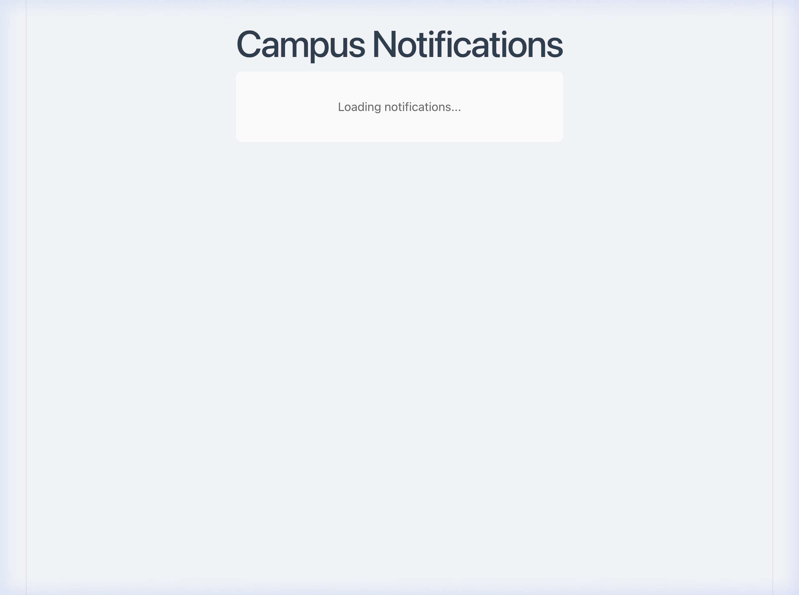
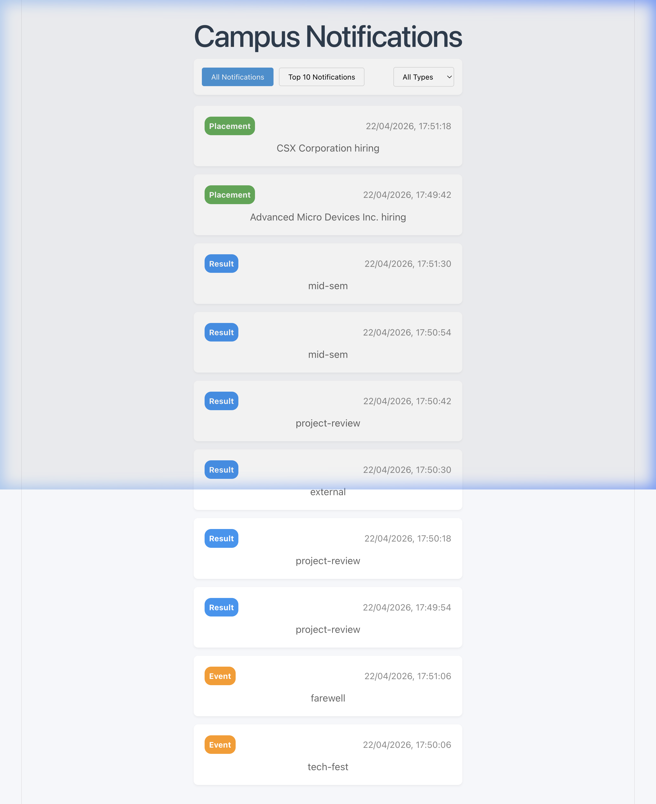
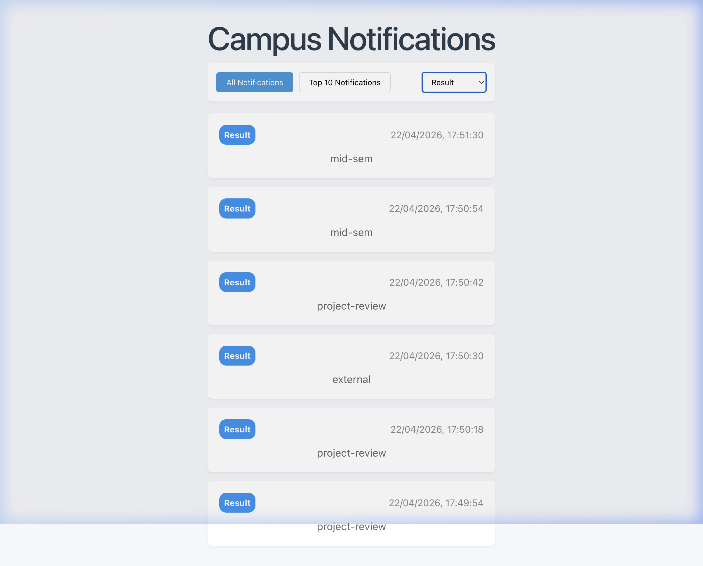
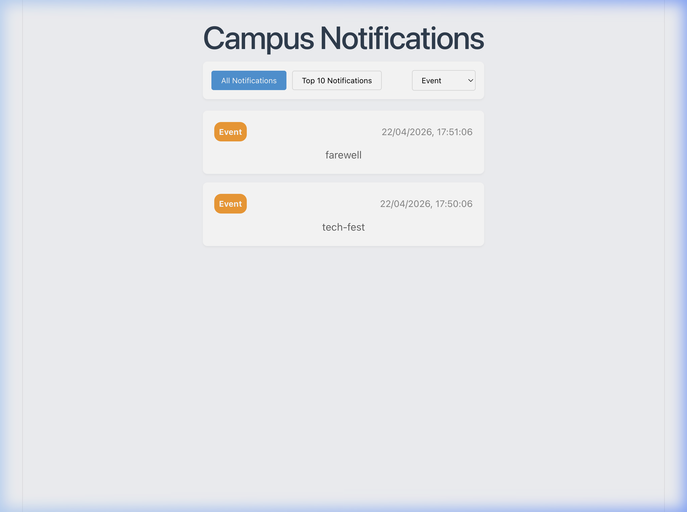
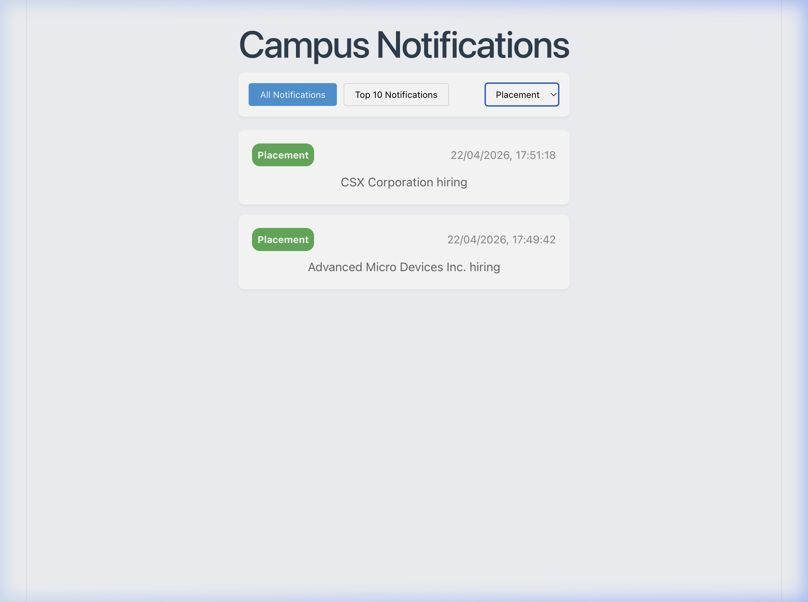

# Campus Notification System

A React + TypeScript (Vite) frontend application for a campus notification system that fetches, sorts, filters, and displays campus notifications.

## Features

- **Fetch Notifications** from a REST API with Bearer token authentication
- **Priority Sorting**: Placement > Result > Event, then by latest timestamp
- **Top 10 Notifications**: Returns the top 10 sorted notifications
- **Filter by Type**: Filter notifications by Event, Result, or Placement
- **Logging Middleware**: All actions are logged to a remote evaluation service
- **Fallback Data**: Gracefully handles API failures with cached notification data

---

## Screenshots

### Loading State
The app shows a loading indicator while fetching notifications from the API.



---

### All Notifications (Default View)
Displays all notifications sorted by priority (Placement → Result → Event) and then by timestamp.



---

### Filter: Result
Shows only **Result** type notifications (mid-sem, project-review, external).



---

### Filter: Event
Shows only **Event** type notifications (farewell, tech-fest).



---

### Filter: Placement
Shows only **Placement** type notifications (CSX Corporation hiring, Advanced Micro Devices Inc. hiring).



---

## Project Structure

```
/src
  /api                    # API services (auth, notifications)
  /components             # React components (NotificationList, NotificationItem)
  /hooks                  # Custom React hooks
  /logging_middleware      # Logging middleware (logger.ts)
  /pages                  # Page components
  /utils                  # Utility functions
```

## Tech Stack

- **React 19** + **TypeScript**
- **Vite** (build tool & dev server with HTTPS proxy)
- **Vanilla CSS** (no Tailwind)

## Logging Middleware

The `Log()` function sends structured logs to the evaluation service:

```typescript
Log(stack, level, package, message)
```

- **stack**: `"frontend"`
- **level**: `"debug"` | `"info"` | `"warn"` | `"error"` | `"fatal"`
- **package**: `"api"` | `"component"` | `"hook"` | `"page"` | `"state"` | `"style"` | `"utils"` | `"middleware"`

## Setup & Run

```bash
npm install
npm run dev
```

Set your access token in the browser console:
```javascript
localStorage.setItem('access_token', 'YOUR_TOKEN_HERE');
```
